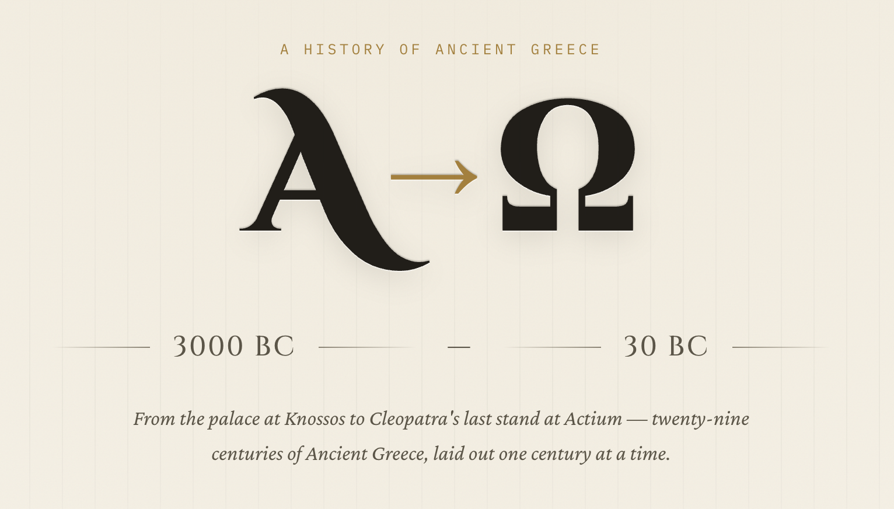

+++
date = 2026-08-04
draft = false
title = 'Educating Emmz'
description = "On turning simple AI answers into educational experiences."
tags = ['claude', 'websites', 'design', 'education']
+++

I went to see *The Odyssey* on Sunday. I loved it: I have never read the
original source material so I don't know what Christopher Nolan changed
in order to to fit twelve thousand lines of dactylic hexameter verse[^1]
into a three-hour movie.

As I was doing some chores earlier in the day, it occurred to me that I didn't even
know when that epic poem was written, or when Homer lived relative to what
I *do* know of Ancient Greece. So I opened Claude Desktop, selected Sonnet 5,
and gave it this prompt:

> can you create a century-by-century timeline of Ancient Greece from start to finish, mentioning cities/city-states, politics, philosophers and thinkers, military conflicts, writers, plays, all that sort of thing

From that it generated 87 lines of pretty dense Markdown with a lot of
facts and names and places and dates, and I thought how much nicer it would
be to read that if the Markdown were rendered into a nice-looking web page.
And then I remembered that I have a full-time full-stack developer available
to me, so I saved the document to a directory, opened a terminal window,
and launched Claude Code, again using Sonnet 5.

## Making it prettier

All I wanted was a single
static page that looked nice, and that provided links to Wikipedia and
YouTube for more information, so I didn't bother with OpenSpec or custom
agents or anything.  Claude Code has a `frontend-design` skill that I've
used to make a few websites look better than I personally could manage,
so I just gave it this prompt:

> turn this into a good-looking, interactive website with drill-down sections and links out to Wikipedia, YouTube, and further reading. use the `frontend-design` skill.

It then asked me four questions up front:

- how to source the external links (research real ones, or fall back to generic search-query links?)
- single scrolling page or a multi-page site
- a choice of three aesthetic directions to take
- should it `git init` a fresh repo

I chose "research real links", single page and a "classical" look,
and gave it permission to run `git init` and then I went and got on
with my housework.

### Permissions improvements

Anthropic recently upgraded their `doctor` skill to audit and fix your
entire Claude Code setup. I strongly recommend running it on your instance
(make sure you're up-to-date first, the skill was upgraded in `v2.1.203`),
because amongst other things it applies some sane permissions at a global
level so Claude no longer asks if it can read/write/edit files in the
current directory, and that sort of thing. It's massively reduced the amount
of babysitting that it requires, so when I came back a bit later, the
website was just there, open, in a Chrome browser window that Claude had
been using to debug it.

### Refinement

And it looked great. I'm sure an experienced human designer could have done
a much better job, and it could probably do with some pictures, but it had
the information and the links. There were a couple of things I wanted
changed: the links were all in a "Further exploration" section rather than
inline, and they were *only* to Wikipedia and YouTube, and I thought that
some more variety would be nice. Back I went to the original chat in
Claude Desktop, and asked it for a bullet list of websites to try searching
for more references, then pasted that into Claude Code with this prompt:

> can you link key phrases directly inside the prose, not just in the reference cards at the bottom of each section, and find more links from
these websites...

By the time I'd finished the washing up, it had finished building what
I have now put online at [atoo.emmz.dev](https://atoo.emmz.dev). I could
probably take a couple more passes at it, maybe add in some pictures or
something, but honestly, it's what I wanted and it took me a matter of
minutes (of my time) to build it while I did the cleaning[^2].

## Thinking a bit bigger

This has got me thinking: I wonder how teachers are using, or could be
using, these amazing tools to create hyper-specific educational materials
for their students? What used to be, in my day, shiny sheets of paper from a
[spirit duplicator machine](https://en.wikipedia.org/wiki/Spirit_duplicator),
or a list of facts laboriously written on a blackboard, or, in my kids'
schools, some bullet points in PowerPoint or Google Sheets, can now be
turned into an engaging interactive experience with hardly any effort at
all. The teacher supplies the facts and the educational intent and desired
outcomes, and Claude or whatever can churn out something a little more
interesting that students might find easier to engage with, using different
design choices for different grades or age groups or demographics or
whatever. So now I have another project: how can I package this to make it
accessible to people who might have heard of HTML but are not really sure
how it works, and can I do it with small, open-weight models so that
our chronically under-funded schools and teachers can use it without a $200/month
subscription? The answer is probably yes; watch this space.

PS: I asked Claude to write its own account of this process, which
[you can read here](/posts/educating-emmz-claude/).

[^1]: Yes, Claude told me that too.
[^2]: I am reminded of the meme about wanting the robot to do the laundry while I do the fun creative stuff.
