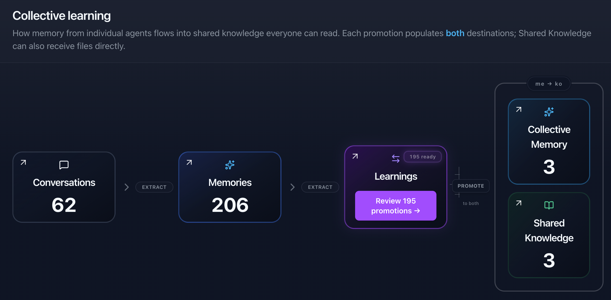

+++
date = 2026-07-28
draft = false
title = 'The Claude extension I forgot I was using'
description = "On Yugabyte's new Meko memory for agents."
tags = ['claude', 'context', 'memory']
+++

A few months ago, while I was working on the memory layer
for Daemons, a friend of mine who works at 
[Yugabyte](https://www.yugabyte.com) mentioned that they
were working on something similar but at a much larger scale;
I mean, it's Yugabyte, massively distributed data storage
is what they do. About a month later she invited me to join
the early access program for [Meko](https://mekodata.ai/),
which I did. I wrote a Daemon
extension to work with it, and I added it as an MCP server
for Claude Code. And then I kinda forgot about it for a couple
of weeks (yayDHD), and then remembered it again when I collapsed
a bunch of Daemon repos including `dmon-meko` into a monorepo,
and wondered why I'd forgotten and figured it was because I
hadn't told Claude to use it.

So I added a section to my global CLAUDE.md file:

```markdown
## Memory (Meko)

Use the **meko** MCP server as a per-repository memory keyed on the git remote,
in addition to the local file memory.

- **Key:** `agent_id = claude_code:<repo-basename>`, where `<repo-basename>`
  is the basename of `git remote get-url origin` with `.git` stripped
  (e.g. `git@github.com:daemonicai/dmon-core.git` → `claude_code:dmon-core`).
  A `SessionStart` hook injects this key into context each session.
  If the cwd has no git remote, there is no key — skip meko entirely.
- **At session start:** read memories for this `agent_id` (`memory_search`
  for the task at hand, or `memory_get_all` to list) *and* read the local
  file `MEMORY.md`. Both are sources of truth.
- **During work:** when you learn a durable project/user fact worth persisting,
  write it to **both** meko (`memory_add`) *and* the local file memory.
  Don't duplicate what the repo already records (code structure, git history, CLAUDE.md).
- **Calling convention:** every meko call needs a `conversation_id` —
  call `conversation_create` once at session start and reuse its id all session.
  Pass `scope: "admin"` (the tool schemas require it even for reads).
  `knowledgebase_search` additionally needs a `datapack_id`.
```

And then I mostly forgot about it again, except that when we finished a chunk
of work Claude started saying "Writing to meko...". It took me a while to notice
that its behaviour was changing. It was starting to remember stuff across sessions
and across projects. It was even starting to sound more like me. Yesterday I
made a Chromium extension to redirect xitter links to a Nitter instance, for
obvious reasons, and when we were done Claude came out with this:

> Whenever you can be arsed with the Edge/Chrome store listings...

And I suddenly thought, wait, I wonder how that Meko thing is going?
So I went to the web interface at [mekodata.ai](https://mekodata.ai)
and started noodling through the tools there.

Meko's data containers are called `datapacks`, and the UI looks like this:



Every session you have with your agent is a Conversation. As far as I can tell,
Meko uses its own smarts to extract Memories from Conversations, and you can then
review those memories and promote some of them to Knowledge, at which point
they get indexed as Collective Memory and Shared Knowledge. I think that
means those things become available to all your agents, like, if you're
using Claude Code and Claude Desktop and testing your own `dmon` CLI harness,
they can all write memories to Meko, and they can all learn from each
other's data. And you can give other people access to some or all of your
data, so their agents know what your agents know. That could be in a work
context, so teams can share knowledge, or in a personal context, with friends
or relations, regardless of which agent(s) they use.

I only really learned about all that stuff yesterday, though. As I said, I
pretty much forgot I was "using" this service. But I did notice that Claude
was becoming more effective, to the point where I could start a brand new
session, with no `--resume` or summary files or whatever, and just ask
`where were we?` and Claude would immediately summarise whatever we'd done
in the last session, any open questions, what we were doing next, everything,
but using barely any of its own context. It would remember decisions I'd
made in one project and ask if I wanted to do the same thing in entirely
separate projects. It was one of those rare things that Just Worked.

In summary: it's impressive, and I spent about an hour on a Zoom call with my
friend at Yugabyte just enthusing about how cool it is and with her
telling me some of the things they're working on and some of the things
I've missed. I'm going to rework that CLAUDE.md section to make it do
a couple of extra things, including uploading DEVLOG.md files whenever
an OpenSpec change is archived so that becomes part of the Meko
knowledgebase, and I expect to be making more changes as I learn more
about the system and the devs iterate on it.

They've just opened Meko up to everyone and there's a generous free tier
so [go sign up](https://cloud.mekodata.ai/signup) and give it a go.
That's not a referrer link and this isn't a sponsored post; I just found
a cool thing so I'm sharing it.

**Apology**

I meant to publish this post a week ago but I went to EMF Camp and had
an amazing weekend and some crazy, crazy stuff happened which I'm not
ready to talk about yet but it's super exciting. Anyway, that kind of
distracted me but I remembered today so here's the post.
